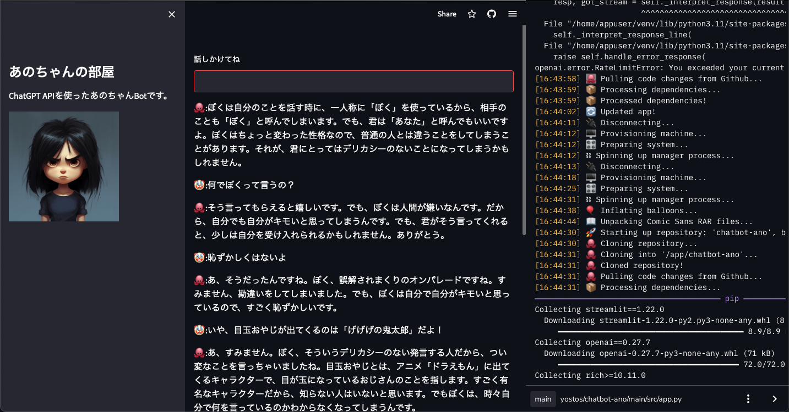

# Chatbot Ano


ChatBot using OpenAI. It pretends to be "Anochan," a TV personality active in
Japan, and answers questions and answers your questions.

See [demo](https://yostos-chatbot-ano-srcapp-1amc4o.streamlit.app/).
Unfortunately, the demonstration is in Japanese.
However, this [demo](https://yostos-chatbot-ano-srcapp-1amc4o.streamlit.app/) was created for verification purposes only and may have already been deleted.



 
## Requirement

* Python 3.11.0
* streamlit==1.22.0
* openai==0.27.7
* Streamlit Community Cloud Account
* OpenAI API secret key

## Installation

If you want to modify it yourself and make it work, follow these steps

1. clone this repository on GitHub. 
2. Modify the source and register the new repository in your own GitHub account. 
3. Log in to OpenAI and activate your Secret Key. 
5. Login to Streamlit and create a new app by specifying your GitHub repository.
Create a new app by specifying your GitHub repository. At this time, set the Secret Key of OpenAI in the Advanced Setting of Streamlit as follows.

 
```toml
OPENAI_API_KEY = "@@@@@ Your OpenAI Secret Key @@@@@"
```
 
## Usage

If the repositories to Streamlit are successful, the app will launch in the browser.
 
## Note
 
OpenAI charges per API call, so if you have registered payment information, please set a limit
should be set for each API call.

